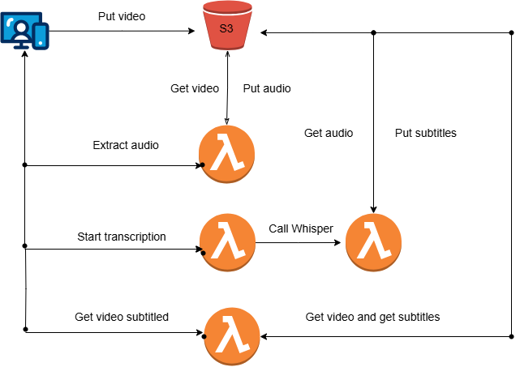

# Video Subtitler backend


This is the backend for website [subtitulatuvideo.es](https://subtitulatuvideo.es/), a project by @cperales and @jomaroru7, aims to provide a website to get your videos subtitled using Whisper as the core of the subtitler AI.

## Architecture

The architecture is hosted in AWS, and everything uses Lambda Functions (yes, even the AI Whisper module!). We optimize the backend to use as few recurses as possible while making the service functional.




## Test locally

Tests with mocks have been included, except for the main function. You can test the rest of the functions by running:

```python
python -m unittest tests/test_add_subtitles.py
python -m unittest tests/test_get_subtitles.py
python -m unittest tests/test_extract_audio.py
```
